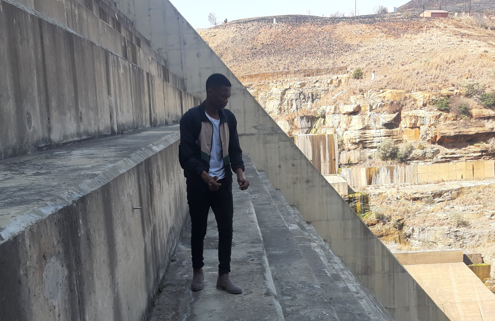

---
hide:
  - toc
  - navigation
---
<!--
CHECKLIST FOR THIS PAGE:
- [ ] Replace [YOUR NAME] with your full name (3 places)
- [ ] Replace [YOUR JOB TITLE] with your current or target role
- [ ] Replace [YOUR TAGLINE] with a short phrase describing your focus
- [ ] Rewrite the About Me paragraph with your own words
- [ ] Replace assets/images/profile.png with your actual photo (keep the filename or update it below)
- [ ] Replace assets/images/about.png with your own image (a field photo, map, or workspace shot)
- [ ] Edit the skill cards to match your actual skills (add, remove, or rename cards as needed)
- [ ] Update GitHub and LinkedIn links in the Connect section
- [ ] Add your CV PDF to docs/assets/ and update the filename in the Download CV button
-->

  
  <h1>Makoanye Maphutseng</h1>
  
<strong>Integrated Catchment and Water Resources Management (ICWRM)</strong>

  
<em>Hydrological Modeling | Climate Modeling | LULUCF Expert | Water Resources Management | Soil Science | Turning Spatial Data into Insights | GIS | Remote Sensing | Python | R |</em>

---

## **About Me**

I am an environmental modeller and soil scientist with expertise in land-use systems, climate change impacts, geospatial analysis, and national greenhouse gas inventories. Over five years of professional experience supporting environmental assessment, climate reporting, and sustainable resource management through advanced data analysis and modelling.
Experienced in integrating land-use, climate, soil, hydrological, and remote sensing datasets to support evidence-based decision-making. I am skilled in SWAT+ hydrological modelling, CMIP6 climate scenario analysis, 
XGBoost machine learning, GIS, remote sensing, Google Earth Engine, R, and Python. I have proven experience coordinating AFOLU/FOLU greenhouse gas inventories in accordance with the 2006 IPCC Guidelines and 
supporting national reporting under the UNFCCC Enhanced Transparency Framework.
I have keen nterest in sustainable land-use planning, environmental modelling, carbon dynamics, biodiversity conservation, and climate adaptation research. I am currently seeking opportunities in the Water and Land Sector in Southern African countries.

  

---

[View My Projects :material-arrow-right:](projects/index.md){ .md-button .md-button--primary }
[Download CV :material-download:](assets/MAKOANYE MAPHUTSENG - CV.pdf){ .md-button }

---

## **Skills**

-   :material-layers:{ .lg .middle } **GIS & Remote Sensing**

    ---

    - QGIS 
    - ArcGIS Pro 
    - Google Earth Engine
    - R & Python
    - SWAT+ & HEC-HMS Hydrological Models
    - ILWIS
    - Remote Sensing
    - Land Use / Land Cover (LULC) Mapping
    - Spatial Analysis & Suitability Mapping
    - Watershed Delineation & Hydrological Modeling
    - Raster & Vector Geoprocessing
    - Cartography & Map Layout Design

-   :material-code-braces:{ .lg .middle } **Climate & Environmental Analytics**

    ---

    - NDVI & Vegetation Health Analysis 
    - Rainfall & Climate Data Processing (CMIP6, CHIRPS & ERA5-Land Data)
    - Soil Moisture Mapping
    - Terrain & Slope Analysis
    - Agricultural & Environmental Monitoring
    - Climate-Smart Agriculture Applications
    - SSP2-4.5 & SSP5-8.5 Scenario Analysis & Projections
    - CMIP6 Data Downscaling 
    - IPCC Software

-   :material-star-four-points:{ .lg .middle } **Machine Learning & GeoAI**

    ---

    - Supervised classification — Random Forest, XGBoost
    - Deep learning for image segmentation — U-Net, SAM
    - scikit-learn, PyTorch, TensorFlow
    - Object detection in satellite imagery

-   :material-earth:{ .lg .middle } **Hazard & Risk Mapping**

    ---

    - Flood Hazard Mapping (100-Year Return Period)
    - Landslide Hazard Mapping
    - ESA Copernicus DEM Processing
    - HEC-HMS & HEC-RAS Integration & Raster Analysis 

-   :material-database:{ .lg .middle } **Data Analytics & Geospatial Data**

    ---

    - Google Sheets & Microsoft Excel Analytics
    - Data Cleaning & Validation 
    - Geospatial Data Management
    - GeoJSON, GeoTIFF, Shapefile, NetCDF, etc
    - Open Geospatial Datasets

-   :material-airplane:{ .lg .middle } **Agriculture & Decision Support**

    - Agricultural Resource Mapping
    - Land Sutability Analysis
    - Catchment & Water Resources Applications
    - GIS for Food Security & Sustainability
    - Decision SUpport for Climate-Resilient Agriculture

-    :material-sitemap:{ .lg .middle } **Remote Sensing & Image Classification**

    - Supervised & Unsupervised Classification in Google Earth Engine, QGIS, and ArcGIS Pro
    - Satelite Image Interpretation & Analysis
    - Sentinel-1, Sentinel-2, and Landsat-6,-7,-8 Data Processing

---

## Connect

[GitHub](https://github.com/Makoanye/makoanye.github.io){ .md-button }
[LinkedIn](https://www.linkedin.com/in/makoanye-maphutseng-1789508a/?lipi=urn%3Ali%3Apage%3Ad_flagship3_profile_view_base_contact_details%3BWoQ893msRUGcP2c3YiGuBw%3D%3D){ .md-button }
